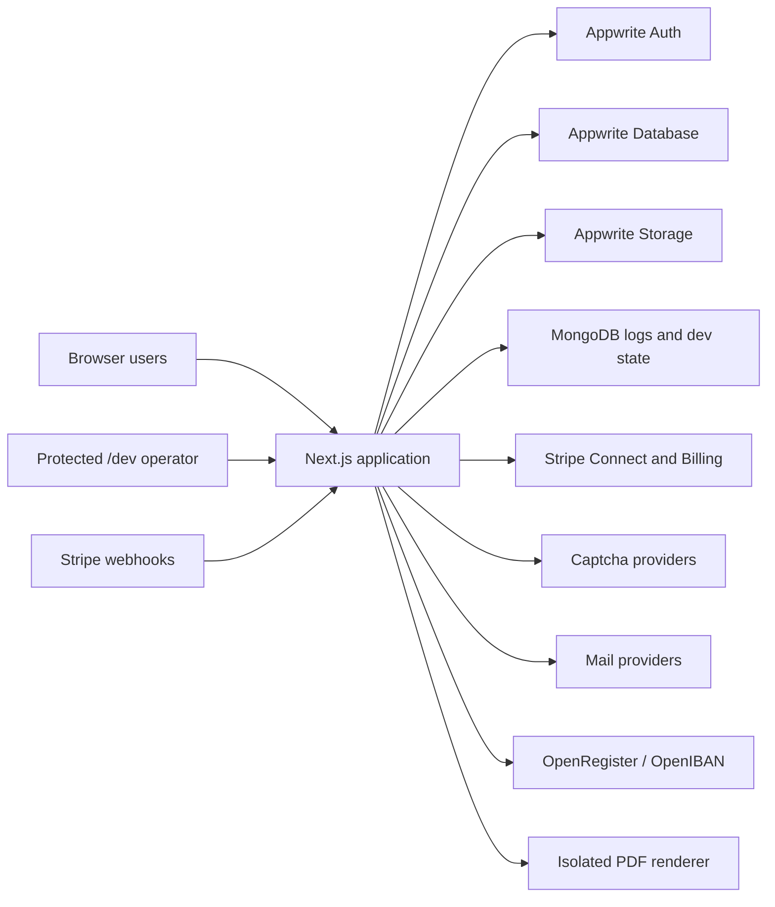

# CoopPilot System Architecture and Engineering Guide

Last repository review: 2026-08-17  
Scope: the complete CoopPilot application in this repository  
Primary audience: engineers and AI coding assistants continuing development

## 1. Purpose and truth rules

This document is the starting map for the whole platform. It explains the deployed architecture, security boundaries, data domains, main workflows, integrations, monitoring, testing, and safe change process.

Use these truth rules:

- **Authoritative code** means behavior directly verified in the named source files.
- **Configuration-dependent** means the path exists but its live behavior depends on environment variables or third-party setup.
- **Known risk** means the design needs further hardening or a business rule still needs an explicit decision.
- Code and current database schemas always override this document if they disagree.
- Never infer access from a client-side tab. Authorization must be enforced in the API route using the server-derived session.
- Never place passwords, API keys, webhook secrets, session secrets, or demo credentials in this file.

The older [ARCHITECTURE.md](./ARCHITECTURE.md) is useful historical context, but this document is the current repository-derived map. The dev-console operating manual is [GEMINI_COOPPILOT_HANDOFF.md](./GEMINI_COOPPILOT_HANDOFF.md).

## 2. Platform at a glance

CoopPilot is a German cooperative-management and auditing platform. It serves cooperative administrators and members, audit-organisation administrators and auditors, plus platform administration. Major capabilities include cooperative onboarding, membership and KYC, shares and payments, assemblies and voting, documents and reports, audits, notices, and controlled feature rollout.

The same deployed application serves public pages, authenticated dashboards, API routes, demo tenants, and the password-protected `/dev` console. Demo data lives in explicitly allowlisted tenants in the same Appwrite project so it exercises the same application code without touching customer tenants.

## 3. Technology stack

| Layer | Current implementation |
|---|---|
| Web application | Next.js App Router, React 18, JavaScript/JSX |
| UI | Tailwind CSS, Lucide icons, Framer Motion, GSAP, Rive, Recharts, TanStack Table |
| Identity | Appwrite Accounts and sessions |
| Transactional/domain data | Appwrite Database |
| Files | Appwrite Storage with server-authorized download routes |
| Operational data | MongoDB through Mongoose |
| Payments | Stripe platform, Connect Accounts v2, subscriptions, webhooks |
| CAPTCHA | TrustCaptcha or Google reCAPTCHA selected by configuration |
| Email | Mailgun/Lettermint and SMTP helpers; Mailcow/IMAP V2 endpoints currently disabled |
| Reports | jsPDF, jspdf-autotable, CSV exports, protected renderer process |
| Validation | Route-level validation, Zod in selected modules, strict-object helpers |
| Logging | Winston-style server logger, edge logger, Mongo transports, request IDs |

Version declarations are in `package.json`; installed and deployed versions can differ until a clean install/build is performed.

## 4. Source layout

| Path | Responsibility |
|---|---|
| `src/app/` | App Router pages, layouts, and all HTTP API endpoints |
| `src/pages/` | Large page-level React components used by App Router wrappers |
| `src/components/` | Domain and shared UI components |
| `src/contexts/` | authentication, language, and theme providers |
| `src/hooks/` | reusable client state and dashboard behavior |
| `src/lib/` | domain services, authorization, integrations, data access, logging |
| `src/lib/auth/` | server-side object and tenant authorization helpers |
| `src/lib/reports/` | report authorization, computation, and export pipelines |
| `src/lib/dev-console/` | feature flags, reset, monitoring, scheduling, and console auth |
| `src/services/` | additional workflow-specific client/service helpers |
| `src/utils/` | mail and general utility functions |
| `scripts/` | VPS release and protected PDF renderer scripts |
| `.private/` | local operational probes or credentials; never commit or document contents |

The application is hybrid: App Router route files frequently render or import components from `src/pages`. Do not assume the presence of `src/pages` means the legacy Pages Router controls routing.

## 5. Runtime and deployment topology

The production-style VPS deployment is a versioned-release model:

1. A release is copied to a new version directory.
2. Dependencies are installed and `next build` runs there.
3. The `current` link is switched only after a successful build.
4. The application service is restarted.
5. HTTP and monitoring smoke checks validate the release.
6. Rollback switches `current` to the prior known-good release.

The detailed commands, paths, current snapshot, and deploy scripts are maintained in `GEMINI_COOPPILOT_HANDOFF.md`. Treat its version number as a point-in-time snapshot, not a permanent fact.

Runtime components are:

- Next.js application bound behind the public HTTPS reverse proxy.
- Appwrite Cloud/project for accounts, domain data, and storage.
- MongoDB for logs, analytics, audit-log records, dev-console state, and monitoring issues.
- A separately launched secure PDF renderer connected through a configured socket.
- External Stripe, CAPTCHA, email, registry, and IBAN services.

## 6. UI and routing architecture

### Public pages

Public routes include the marketing site, pricing, contact, role selection, cooperative/member/audit signup, sign-in, password recovery, public verification, and proxy-voting entry. Public API access is an explicit allowlist in `src/proxy.js`; a page being public does not automatically make its APIs public.

### Authenticated pages

The authenticated layout adds the main navigation and relies on `AuthContext` plus `/api/auth/session`. Main route wrappers include dashboard, profile, member, admin, audit, sub-auditor, cooperative detail, audit detail/report, and superadmin surfaces.

`src/pages/Dashboard.jsx` dispatches the dashboard by the canonical profile role:

| Stored role | Dashboard |
|---|---|
| `coopadmin` | Cooperative administrator |
| `member` | Cooperative member |
| `org_admin` | Audit-organisation administrator |
| `auditer` | Lead auditor |
| `aud_E` | Sub-auditor/team auditor |
| `superuser` | Platform administration |

`superadmin` and `aud_T` appear in selected server allowlists but are not equivalent dashboard dispatch roles. This role-name ambiguity is technical debt; do not add new spelling variants.

### Cooperative administrator modules

The administrator dashboard contains or references overview, members, onboarding, KYC/verification, shares and transactions, payouts, assemblies, attendance/voting/minutes, documents, reports, notices, settings, audit/tickets, finance/subscriptions, profile, mail, and feature-test navigation. Availability can depend on cooperative state and feature flags.

### Member modules

Member surfaces cover profile, cooperative relationships, onboarding/application state, KYC status, shares/transactions, documents, assemblies, votes, and notifications. Every member API must derive the caller from the session; a request-supplied member ID is never proof of ownership.

### Audit modules

Audit-organisation and auditor surfaces cover organisation/team management, cooperative assignment, audit history, comments, deadlines, discrepancies/issues, uploaded evidence, audit forms, reports, and founding audits. Organisation membership and assignment are separate authorization questions and both may be required.

## 7. Authentication and session model

Authoritative implementation: `src/lib/auth/session.js`, authentication API routes, and `src/contexts/AuthContext.jsx`.

1. The server sends credentials to Appwrite and obtains an Appwrite session secret.
2. The application stores only that opaque secret in the `appwrite-session` HTTP cookie.
3. On each protected request, `resolveSession()` verifies the session against Appwrite `/account`.
4. The application loads the profile using the verified Appwrite user ID. Team members are resolved by the verified account email and Appwrite label.
5. Role, cooperative, audit organisation, and verification state are derived server-side from stored records.

Legacy cookie JSON and raw cookie formats remain temporarily readable, but any identity or role fields inside them are ignored. The client can display access state but cannot grant it.

`requireRole()` rejects unauthenticated users, disallowed roles, inactive audit-team accounts, and profiles explicitly marked unverified. Object-level helpers then enforce access to the requested cooperative, member, transaction, ticket, assembly, vote, audit, Stripe resource, onboarding invitation, or file.

Logout attempts to revoke the current Appwrite session and deletes the application cookie.

## 8. Request security boundary

`src/proxy.js` is the first application-wide request boundary:

- Adds an `x-request-id` to requests and responses.
- Rejects cross-site state-changing requests when an authenticated cookie is present.
- Applies IP/path/method rate limits.
- Requires a session cookie for APIs not present in the explicit public allowlist.
- Temporarily returns `503` for all `/api/mailsV2` routes.
- Returns `503` for manual transaction payment confirmation; provider webhooks must confirm payments.
- Sends non-static request events to the edge-safe logger.

Important limitation: the current rate-limit map is process-local memory. Multiple instances do not share counters, and counters disappear on restart. Use a distributed limiter before relying on it for horizontally scaled abuse protection.

Security headers are configured in `next.config.js`, including CSP, HSTS, frame denial, MIME sniffing protection, referrer/permissions policies, COOP, and no-store behavior for APIs.

Route handlers must still authenticate and authorize. The proxy's cookie-presence check is defense in depth, not session verification.

## 9. Multi-tenancy model

The cooperative ID (`coopId`) is the primary tenant boundary for cooperative data. Audit data additionally uses `auditOrgId`, audit/team assignment, or both. A profile may relate to multiple cooperatives through membership records, so the profile itself is not the complete tenancy map.

Correct access sequence:

1. Resolve and verify the session.
2. Load the canonical application profile or team-member record.
3. Validate the role for the operation.
4. Load the target object by its ID.
5. verify the object belongs to the requested cooperative/organisation.
6. Verify the caller has an administrator, membership, organisation, or assignment relationship to that same tenant.
7. Perform the read/write using server-selected tenant identifiers.

Never query/update an object solely because the caller supplied both its ID and a `coopId`. This is the classic cross-tenant BOLA failure mode.

Demo tenants obey the same model. Reset code refuses targets outside the fixed demo cooperative and demo audit-organisation allowlist.

## 10. Data architecture

### Appwrite

`src/lib/appwrite-server.js` is the authoritative catalog for database, collection, and bucket constants and for the privileged server client. Prefer exported symbolic constants over copied literal IDs.

Collections are grouped below by purpose:

| Domain | Principal collections |
|---|---|
| Identity and cooperative registry | profiles, cooperatives, cooperative registry/platform registry, sectors, states |
| Membership | cooperative-member relations, onboarded members, onboarding logs, user text forms, groups and group members |
| KYC/profile | KYC applications, KYC documents, profile update requests |
| Shares and money | transactions, transaction ledger, shares, pending payouts, cooperative payment credentials, subscriptions, plans, Stripe webhook events |
| Governance | assemblies, attendance, assembly resolutions/votes, immutable vote casts, proxies, minutes |
| Documents/settings | cooperative documents, document registry, settings/config, settings audit |
| Audit | audit organisations, team members, team-to-cooperative assignments, audit history, forms, current form, comments, logs, discrepancies, reports, invitations |
| Founding audit | instances, members, evidence/documents |
| Communication | notifications, notices, tickets, comments, suggestions, contact submissions, mail directory/mail records |

Appwrite Storage holds audit evidence, AVV-related material, reports, founding-audit uploads, onboarding files, and other configured document classes. Browser-facing file links should be generated through secure file URL helpers and served through `/api/files/[bucketId]/[fileId]`, which calls `authorizeFileAccess()` before downloading. Do not introduce raw storage URLs for protected files.

The server Appwrite client uses an API key and has privileged database access. Therefore collection permissions alone are insufficient: every server route must implement authorization before calling it.

### MongoDB

MongoDB is connected through `src/lib/db/mongoose.js`. Current models are:

- `SystemLog`: operational/server events.
- `AuditLog`: structured application audit records.
- `AnalyticsLog`: submitted analytics events.
- `DevConsoleState`: feature toggles, scheduling, last-run state, and run summaries.
- `DevIssue`: monitoring issue name, latest time, and Open/Resolved state.

MongoDB is not the authoritative member/share/vote ledger. Do not move domain decisions into logs.

### Pagination and indexes

Appwrite list calls have default limits. Use the repository pagination helper or explicit paging for complete ledgers, reports, resets, and registries. Security-critical uniqueness—such as one ballot per voter/poll or provider event idempotency—must be backed by a database constraint/transactional design, not only a preflight query.

## 11. Domain workflows

### Cooperative creation and administration

Both legacy and V2 cooperative signup route families exist. They cover registry lookup, existing-account checks, email/phone verification, application creation, pending review, and approval. Active UI consumers must be traced before editing one family; do not assume the legacy family is unused.

Cooperative settings have dedicated current-state and history/audit collections. Administrators can manage tenant configuration only after a server-side cooperative-admin relationship check.

### Membership and onboarding

There are two broad entry paths: a person applies/joins through member-facing flows, or a cooperative administrator onboards/invites a member. Records span profile, membership relationship, onboarding history, KYC, transaction/share, and notification data.

Membership status values currently include variants such as `Active`, `NoticeGiven`, `Former`, `pending`, and `rejected`. Capitalization and vocabulary are not fully normalized. Preserve the exact contract used by the consuming route until a deliberate migration centralizes the enum.

A member may remain a legal member with zero shares after selling/exiting their capital position, depending on the cooperative's business rules. The code audit therefore treats membership status and share balance as distinct facts. Requirements for a later repurchase, including KYC revalidation, need a centralized policy rather than assumptions based only on “first purchase.”

### KYC

KYC applications and documents are cooperative-scoped. Members see their status; cooperative administrators review the application for their cooperative. Typical values include `PENDING` and `VERIFIED`.

Demo monitoring contains a seeded pending applicant and tests administrator approval plus the resulting stored state. Production KYC must not be globally bypassed for demo users. If an external provider is added, use its sandbox/test mode and explicitly mark external-provider checks separately from internal workflow checks.

### Shares, transactions, payouts, and payments

Transaction APIs cover proposal creation, tenant/member listings, status changes, verified ledgers, and Stripe-backed purchases. Common verification values are `pending`, `verified`, and `rejected`.

Stripe architecture includes:

- A platform Stripe client configured server-side.
- Cooperative payment/Connect state and account links.
- Member checkout/purchase creation.
- Cooperative platform subscription and customer portal routes.
- Three webhook destinations: Connect snapshot, platform snapshot, and platform thin events.
- A webhook-event collection for idempotency.

Manual `/api/transaction/[id]/pay` is deliberately unavailable; successful payment state must come from a verified Stripe webhook. Test and live Stripe credentials must never be mixed. Demo monitoring uses a dedicated test-mode key.

Share balance, transaction verification, membership activation, and payout lifecycle cross several documents. Changes require explicit idempotency and recovery behavior. See the workflow risk register before modifying these paths.

### Assemblies, attendance, proxies, voting, and minutes

Assembly routes manage creation, updates, member views, uploads, attendance, quorum, resolutions/votes, proxy sessions, and minutes data. Status vocabulary includes `draft`, `scheduled`, `live`, `closed`, `archived`, and `discarded`, with some legacy/time-derived behavior still present.

Voting uses an immutable assembly vote-cast collection and an Appwrite transaction so “record ballot” and “increment option/count state” succeed together. A unique ballot key prevents duplicate voting across application instances. An in-memory mutex is not sufficient for election integrity.

Proxy voting has a separate login/session/logout path. Proxy authorization, attendance eligibility, poll timing, and quorum calculation are security-sensitive and must be tested together.

### Documents and reports

Document services cover cooperative document registries, shared document links, uploads, and tenant/member reads. Every update must load the target document and verify that it belongs to the authorized cooperative.

Current report pipelines include share register and capital summary, with report-specific session/permission helpers, deterministic computation modules, and PDF/CSV exports. Reports derive from stored ledgers as of a requested date (`Stichtag`), so complete pagination and consistent status filtering are mandatory.

Some audit PDFs are generated through a separate renderer process. Renderer URLs and socket access are security boundaries; never allow arbitrary public URLs to become renderer input.

### Audits and founding audits

Audit organisations contain administrators and team members. Cooperatives can be invited/attached, assigned to auditors, and audited through history, status, comments, evidence, discrepancy, form, ticket, and report workflows.

Founding audits have separate instance, member, form-computation, evidence upload, and generated assessment (`Gutachten`) logic. The `src/lib/founding-audit/` schema and computation files are the canonical form model.

Audit status logic is distributed across `AuditStatus`, services, and route handlers; no single exhaustive state machine was verified. Before changing transitions, inventory all writers and readers and encode the allowed transition table in tests.

### Communication

Notifications, notices, suggestions, contact submissions, tickets, and audit comments are separate domains. The legacy authenticated mail-send route must restrict recipients by role and tenant relationship.

All `/api/mailsV2` endpoints are currently blocked at the proxy because their mailbox/alias model requires a complete authentication and ownership redesign. Do not re-enable the prefix route-by-route without addressing mailbox ownership, send authority, Mailcow provisioning authority, input limits, and credential handling.

## 12. API surface map

There are currently 224 API route files. The important route families are:

| Prefix | Domain |
|---|---|
| `/api/auth`, `/api/forget-password` | sessions, registration, recovery |
| `/api/coopAdminSignUp`, `/api/coopAdminSignUpV2` | cooperative onboarding and approval |
| `/api/cooperative`, `/api/coops`, `/api/coop-services` | cooperative registry, settings, details, documents, assignments |
| `/api/coop-r-member`, `/api/member`, `/api/addMember`, `/api/coop-admin` | membership, onboarding, KYC, cancellation/payout views |
| `/api/transaction`, `/api/payments` | share transactions, Stripe and webhooks |
| `/api/assembly`, `/api/vote` | assemblies, attendance, proxies, ballots, quorum, minutes |
| `/api/reports` | share-register and capital-summary reports |
| `/api/auditServices`, `/api/auditor`, `/api/orgadmin`, `/api/audit-forms` | operational and founding audits |
| `/api/ticket`, `/api/notification`, `/api/notices`, `/api/suggestions` | communication and workflow alerts |
| `/api/files`, upload routes | authorized file access and upload |
| `/api/mail`, `/api/mailsV2` | legacy mail and disabled mailbox V2 |
| `/api/dev-console`, `/api/features` | operator console, monitoring, reset, feature rollout |

When adding an endpoint, decide its public/private status in `src/proxy.js`, then implement route-level authentication, role authorization, object ownership, tenant validation, strict input validation, limits, safe errors, and an audit/monitor test where appropriate.

## 13. External integrations

| Integration | Purpose | Important boundary |
|---|---|---|
| Appwrite | identity, data, storage, transactions | privileged server key; enforce access in routes |
| Stripe | Connect accounts, member payments, subscriptions | verified signatures, idempotent events, test/live separation |
| TrustCaptcha / Google | abuse protection on public/auth flows | client site key plus server secret verification; exact domain authorization |
| OpenRegister | cooperative/company lookup | validate identifiers, cache, rate-limit to protect quota |
| OpenIBAN | IBAN structure/bank lookup | external availability is not proof of account ownership |
| Mailgun / Lettermint / SMTP | transactional messages | recipient authorization, generic client errors, secret protection |
| Mailcow / IMAP | mailbox provisioning/read/send | currently disabled pending ownership redesign |
| PDF renderer | controlled server-side HTML/PDF generation | socket isolation and strict input/source controls |

An external integration check and an internal workflow check are different results. For example, validating an IBAN format does not prove that the user owns the bank account, and a successful Stripe sandbox call does not prove live webhook configuration.

## 14. Feature rollout and demo tenants

Feature definitions live in `src/lib/dev-console/features.js` and are stored through the dev-console state. Each feature has independent `demoEnabled` and `customerEnabled` switches.

- Demo users log in through the normal application sign-in page.
- `/api/features` returns only flags applicable to the authenticated user's tenant and role.
- Demo enablement exposes a feature only to the allowlisted demo cooperative/audit organisation.
- Customer enablement exposes it to real eligible tenants.
- Customer rollout is intentionally not locked behind monitoring; the operator owns that decision.
- New feature code, its catalog entry, UI guard, tenant-safe API authorization, reset fixture (if data-bearing), and monitoring tests should ship together.

The temporary “Test blank tab” proves the rollout path. It is not a business feature and should be removed when no longer needed.

## 15. Demo reset and monitoring

The reset operation restores only allowlisted demo-owned records to a versioned baseline. It does not reset Appwrite globally and must never accept an arbitrary customer tenant ID. Operators can run it from the `Reset demo` tab by typing the confirmation word.

Monitoring supports manual full runs, individual tests, a configurable daily IST time, and an off switch. A full run normally:

1. Acquires the run lock.
2. Restores the demo baseline.
3. Authenticates dedicated demo roles through the normal login path using a short-lived monitor-only CAPTCHA proof.
4. Executes registered API, workflow, tenant-isolation, permission, provider-sandbox, voting, and concurrency checks.
5. Restores the baseline again even after a failure.
6. Stores the latest summary, detailed logs, and issue transitions.

The UI shows progress while running, the latest run summary, expandable last-run logs, and issues. The Issues tab deliberately exposes only issue name, latest time, and Open/Resolved state. Marking an issue Resolved reruns its test; it remains resolved only if confirmation passes.

Monitoring coverage is registry-driven, not “everything automatically.” The authoritative test list is `src/lib/dev-console/registry.js`; every new workflow needs a deliberately written test. Current coverage details and limitations are in [DEV_MONITORING_COVERAGE.md](./DEV_MONITORING_COVERAGE.md).

## 16. Observability and auditability

- Every proxied dynamic request receives an `x-request-id` for correlation.
- Edge/server/client logger layers redact configured sensitive fields before transport.
- System, analytics, and audit records are stored separately in MongoDB.
- Appwrite data operations are wrapped by server services/logging in selected paths.
- Monitoring run logs are operational evidence, not a replacement for immutable business audit logs.
- User-facing errors should be generic and include a request/error ID; raw caught objects belong only in redacted server logs.

Do not trust client-supplied `actorId`, role, cooperative, or audit organisation in analytics/audit attribution. Derive identity from the verified session whenever one exists. Public analytics/contact endpoints need payload-size controls and durable rate limiting if exposed at scale.

## 17. Security posture and remaining limitations

Verified controls include server-derived sessions/roles, route-level authorization helpers, cross-site mutation protection, security headers, protected file downloads, Stripe webhook confirmation, disabled high-risk mailbox APIs, request IDs, input checks in high-risk routes, and database-backed atomic vote casting.

Do not interpret that list as “all security issues solved.” Important continuing work includes:

- Replace process-local rate limiting with a shared durable limiter for multi-instance deployment.
- Normalize role and status vocabularies through planned migrations.
- Complete and test recipient/tenant policy for legacy mail.
- Keep mailbox V2 disabled until redesigned.
- Apply strict limits and server-derived identity to analytics/contact/public lookup routes.
- Validate every object-to-tenant relationship before update or delete.
- Review Appwrite indexes/uniqueness for all idempotent financial and lifecycle operations.
- Maintain pagination for full-register/report/reset operations.
- Perform load, race, webhook replay, partial-failure, and recovery tests.
- Reconcile legacy and V2 duplicate workflows before retiring either.

The detailed business edge-case inventory is [FEATURE_1_MONITORING_WORKFLOW_AUDIT.md](./FEATURE_1_MONITORING_WORKFLOW_AUDIT.md). It covers membership activation, cancellation and zero-share states, KYC repurchase rules, payments, payouts, assemblies, proxies, quorum, duplicate requests, and recovery. Recheck each item against current code before declaring it open or closed.

## 18. Environment configuration

Use `.env.example` as the non-secret template. Configuration categories include:

- Appwrite endpoint, project, database, API key, collection overrides, OTP function.
- Public Appwrite client identifiers only where browser realtime/client access is intentional.
- MongoDB URL/name and log collection names.
- CAPTCHA provider plus public site key and server verification secret.
- Stripe secret, API version, three webhook secrets, deployment URL.
- OpenRegister key.
- Transactional email/SMTP provider settings and mail credential encryption key.
- Upload malware scanning policy.
- PDF renderer binary/socket.
- `/dev` console password/session secret.
- Demo tenant IDs, reset manifest, monitor accounts, internal signing secret, Stripe test key, base URL, and scheduler switch.

Rules:

- Never expose server secrets with `NEXT_PUBLIC_`.
- Never use a live Stripe key for demo monitoring.
- Keep console password and console session secret independent.
- Keep the demo account manifest in deployment secrets, not Git.
- Rotate a secret immediately if it appears in chat, screenshots, logs, commits, or documentation.

## 19. Engineering change playbooks

### Finding credentials and operational access safely

An authorized coding agent should use the following locations. Read values only when the task requires them, never print them, and never copy them into source files, documentation, commits, logs, screenshots, or chat responses.

| Required access | Where to obtain it |
|---|---|
| VPS SSH identity | Local private key `.private/monujesh_cooppilot_vps_ed25519`; verify the host with `.private/known_hosts` |
| VPS host/user and release paths | `GEMINI_COOPPILOT_HANDOFF.md`, then `scripts/deploy-monujesh-vps.ps1` |
| Production application secrets | On the VPS in `/home/monujesh/apps/cooppilot/shared/.env.production`; inspect only through an authorized SSH session |
| Appwrite endpoint/project/database/API key | Production environment file above; local security probes may use `.private/appwrite-test-access.env` |
| Demo account credentials | `DEV_MONITOR_ACCOUNTS_JSON` in the production environment file; consume through monitoring/reset code and do not echo it |
| Demo tenant IDs and reset baseline | `DEV_DEMO_*` variables in the production environment file |
| Stripe platform, sandbox, and webhook secrets | Corresponding `STRIPE_*` and `DEV_MONITOR_STRIPE_*` variables in the production environment file |
| CAPTCHA keys/provider | `CAPTCHA_PROVIDER`, `TRUST_CAPTCHA_*`, or `RECAPTCHA_*` variables in the production environment file |
| MongoDB | `MONGODB_URL` and `MONGODB_NAME` in the production environment file |
| Mail providers | Mail-related variables in the production environment file; specialized local Mailcow probes may use `.private/mailcow-test-access.env` |
| PDF renderer | Renderer socket/binary variables in the production environment and renderer scripts under `scripts/` |

`.env.example` defines expected variable names but contains placeholders, not operational credentials. The `.private` directory is local, excluded operational material; inspect only the specific file required for the current task. Do not search or dump the entire directory when one known file is sufficient.

Recommended access sequence:

1. Read the relevant architecture/handoff section and identify the minimum required service.
2. Confirm the task authorizes read-only inspection, mutation, or deployment as applicable.
3. Use the known credential location without displaying its contents.
4. Run the smallest scoped diagnostic or operation.
5. Redact secrets and personal data from captured output.
6. For VPS changes, create a versioned release, verify it, and retain rollback; never edit the active release directly.

### Adding a normal feature

1. Identify affected roles, tenants, objects, status transitions, and immutable records.
2. Locate every current writer and reader, including legacy route families.
3. Define validation and the server-side authorization matrix.
4. Implement domain logic in a service/helper where it is shared; keep route handlers thin.
5. Use database transactions/idempotency for multi-record or externally retried writes.
6. Add UI with loading, empty, error, and permission states.
7. Add automated success, denial, cross-tenant, invalid-input, retry, and concurrency coverage.
8. Run lint/build and targeted tests.

### Adding a rollout-controlled feature

In addition to the normal feature steps:

1. Add one catalog entry with name and added date.
2. Guard UI exposure with the server-returned feature state.
3. Keep API authorization independent of the UI flag.
4. Seed demo test cases and update the versioned baseline.
5. Register monitoring checks at the same time.
6. Enable demo first; customer enablement remains an explicit operator choice.

### Changing a collection/schema

1. Inventory field readers/writers and indexes.
2. Design a backward-compatible rollout and data migration.
3. Update reset fixtures, report transforms, authorization helpers, and monitoring assertions.
4. Deploy schema/index support before code that requires it.
5. Verify old and new records during the transition.

### Changing an external integration

1. Use official provider documentation and test/sandbox credentials.
2. Preserve signature verification, idempotency, timeouts, and safe retries.
3. Model provider outage and delayed/out-of-order callbacks.
4. Keep provider state distinct from internal business state.
5. Add a test that proves the callback changes only the correct tenant/object.

## 20. Verification and release checklist

Minimum checks before release:

- Inspect `git status` and do not overwrite unrelated local work.
- Run targeted lint/tests for changed files, then `npm run build`.
- Review route authentication, role checks, object ownership, and tenant binding.
- Confirm public API allowlist changes are deliberate.
- Confirm logs and errors do not expose secrets or personal data.
- Confirm complete pagination and expected indexes for list/report operations.
- Run demo reset and monitoring tests relevant to the change.
- Build a new versioned VPS release; do not edit the active release in place.
- Verify the public endpoint, authentication, feature state, and monitoring summary.
- Keep the prior release available for rollback.

Passing monitoring proves the registered workflows on the seeded demo dataset at that moment. It does not prove unregistered edge cases, production load behavior, every third-party live-mode configuration, or correctness of user-supplied real-world data.

## 21. Known architecture decisions still needed

The following should become explicit, centralized product policies:

- Exact KYC requirement for initial purchase, repeat purchase, expiry, changed identity data, and repurchase after selling all shares.
- Legal relationship between membership status and zero-share balance.
- Permitted purchases while cancellation/exit/payout is pending.
- Canonical role names and migration from aliases/misspellings.
- Canonical state machines for membership, transaction, payout, assembly, vote, audit, and onboarding.
- Whether and how mailbox/email functionality returns.
- Retention policy for logs, monitoring runs, resolved issues, uploaded evidence, and demo data.
- Distributed rate limiter and job scheduler technology for multi-instance operation.
- Production-grade performance/load targets and monitoring SLAs.

Until decided, do not hide ambiguity inside UI conditions. Record the decision, enforce it in one domain policy, and test every transition.

## 22. Reference index

| Document/file | Use it for |
|---|---|
| `COOPPILOT_SYSTEM_ARCHITECTURE.md` | whole-platform map and engineering rules |
| `GEMINI_COOPPILOT_HANDOFF.md` | detailed demo/dev-console/monitoring/VPS operations |
| `DEV_MONITORING_COVERAGE.md` | registered monitor scope and limitations |
| `FEATURE_1_MONITORING_WORKFLOW_AUDIT.md` | business edge cases and risk checklist |
| `.env.example` | non-secret configuration contract |
| `src/proxy.js` | global request policy and public API allowlist |
| `src/lib/auth/session.js` | canonical session and role resolution |
| `src/lib/auth/*-access.js` | object- and tenant-level authorization |
| `src/lib/appwrite-server.js` | Appwrite collections, buckets, and server client |
| `src/lib/dev-console/registry.js` | actual monitoring coverage |
| `src/lib/dev-console/reset.js` | demo reset safety boundary |
| `src/lib/dev-console/features.js` | rollout catalog |
| `src/lib/stripe/` and `/api/payments` | Stripe configuration and payment flows |
| `src/lib/reports/` | deterministic reporting pipelines |
| `scripts/deploy-monujesh-vps.ps1` | local deploy entry point |
| `scripts/vps-release-orchestrator.sh` | server-side release/build/switch/rollback flow |

## 23. Fast orientation for the next engineer or AI

Before changing code, read this file, then read the domain-specific source and relevant handoff/risk document. Search with `rg` for the route, collection constant, status string, and UI consumer. Verify behavior from code rather than names. Preserve the dirty worktree. Never deploy unless explicitly requested. Never claim comprehensive monitoring or security based only on a green summary. Keep all production customer data outside demo reset/monitor mutations, and treat tenant isolation, vote integrity, payment idempotency, and immutable audit history as non-negotiable boundaries.
